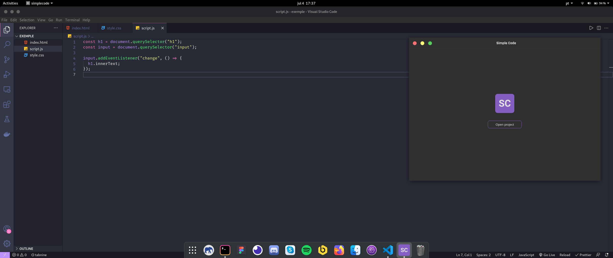

<h1 align="center">Welcome to Simple Code 👋</h1>



<p>
  <a href="https://www.npmjs.com/package/Simple Code" target="_blank">
    
  </a>
  <a href="#" target="_blank">
    
  </a>
  <a href="https://twitter.com/daniellmvaz" target="_blank">
    
  </a>
</p>

> An simple application to code and view the progress of your code

### 🏠 [Homepage](https://github.com/daniellvaz/simple-code)

## Install

```sh
yarn install or npm install
```

## Usage

```sh
run yarn start or npm start to build the application and start the electron. Run yarn electro or npm electron to run electron separately.
```

## Author

👤 **Daniel Murilo Vaz**

- Website: https://www.linkedin.com/in/daniel-murilo-vaz/
- Twitter: [@daniellmvaz](https://twitter.com/daniellmvaz)
- Github: [@daniellvaz](https://github.com/daniellvaz)
- LinkedIn: [@daniel-murilo-vaz](https://linkedin.com/in/daniel-murilo-vaz)

## Show your support

Give a ⭐️ if this project helped you!

---

_This README was generated with ❤️ by [readme-md-generator](https://github.com/kefranabg/readme-md-generator)_
